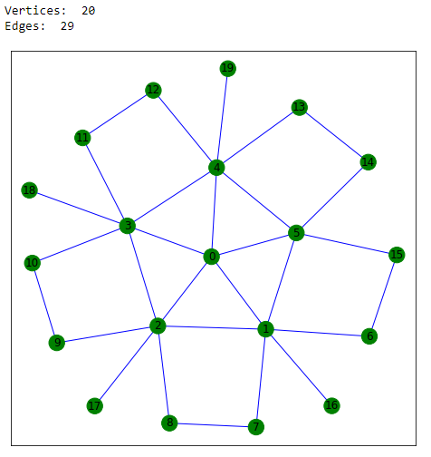

# NetworkSimulator
Simulation of packages in network for different graph topologies and intensity matrices.  
Simulation can be done either in place or as a cyclic process.

This project uses Networkx library for graph utilities and visualization.

